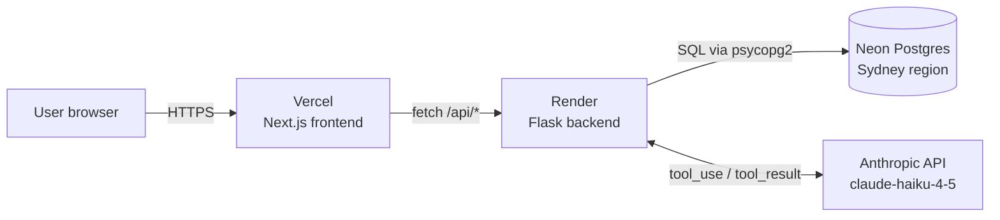
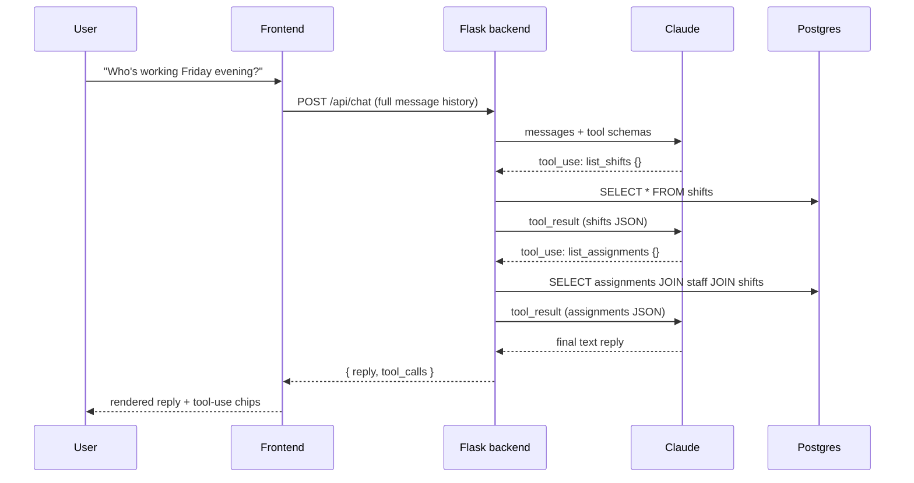

# Zenith Roster Analyzer

AI-powered staff rostering prototype for hospitality operations. Venue managers define their staff list and weekly shift requirements; Claude generates an optimised roster that respects weekly-hour caps and role coverage. A built-in AI Command Center lets managers run the whole system through natural language ("who's working Friday?", "take Sophie off the Monday evening shift") backed by Anthropic tool calling.

## Live demo

- App: **https://zenith-roster-analyzer.vercel.app**
- API health: https://zenith-roster-backend.onrender.com/api/health

No login required — the demo is seeded with 20 staff across the roles a mid-size hotel actually runs (managers, chefs, bartenders, waiters, receptionists, housekeeping, security, concierge, porter) with a realistic mix of full-time, part-time, and casual hours.

## What it does

- **Staff & shift CRUD** — add, remove, and list staff and weekly shift slots from the UI
- **AI-generated roster** — one click sends the whole staffing picture to Claude, which returns a full weekly assignment plan that respects each person's max weekly hours and each shift's role requirements
- **AI Command Center** — a chat interface that can read *and write* the roster. Backed by an agentic tool-use loop: Claude can call `list_staff`, `list_shifts`, `assign_staff_to_shift`, `unassign_staff_from_shift`, and the application-approval tools in sequence to fulfil a single user instruction
- **Shift bidding** — staff can apply to open shifts; managers (or Claude) approve or reject

## Architecture



Three deploy targets, chosen for fit rather than uniformity: Vercel handles the static Next.js bundle, Render runs the long-lived gunicorn process Flask expects, and Neon provides serverless Postgres with pooled connections that tolerate Render's free-tier cold starts.

## How the AI Command Center works

The chat endpoint runs Claude inside an agentic loop. Each user message can trigger multiple tool calls before the model produces its final natural-language reply.



The loop has a hard cap of 10 tool rounds as a safety bound against runaway agents. All tool execution happens server-side so API keys never reach the browser, and every tool result feeds back through Claude's context — the model is stateful within a turn.

## Tech stack

| Layer        | Choice                                                                 |
|--------------|------------------------------------------------------------------------|
| Frontend     | Next.js 15 (App Router), TypeScript, Tailwind CSS                      |
| Backend      | Flask 3 (blueprints + app factory), Pydantic 2, gunicorn               |
| AI           | Anthropic Python SDK, `claude-haiku-4-5-20251001`                      |
| Database     | Postgres on Neon (prod) with SQLite fallback for local dev             |
| Hosting      | Vercel (frontend), Render (backend), Neon (DB)                         |

The persistence layer (`backend/app/database.py`) is a single module that picks its driver from `DATABASE_URL` at import time, exposes one API (`list_staff`, `add_shift`, etc.), and hides the SQLite vs Postgres dialect differences from every caller — so the same codebase runs identically on a laptop and in production.

## Design decisions

- **Pydantic at both boundaries.** Incoming user requests are validated before anything hits the database, and Claude's tool-use inputs are validated before they're executed. Neither side is trusted by default.
- **Prompts are code.** System prompts live in `backend/app/prompts.py`, versioned in git, diff-reviewable, testable.
- **Server-driven state.** The frontend is a thin renderer over `/api/state`. After any mutation (AI or manual) it refetches. No client-side cache to drift out of sync.
- **Low-temperature rostering, agentic chat.** The roster generator runs with a tight temperature because rostering is a constraints problem. The chat agent leans on multi-step tool calls because the job is navigation, not generation.
- **Dual-driver DB.** One import-time branch decides SQLite vs Postgres; every public function has both SQL dialects baked in. Developer experience on a laptop should not require docker-compose.

## What I'd build next

The roadmap below reflects real hospitality workflows I've experienced firsthand and is prioritised by impact rather than ease.

1. **Overnight shifts.** Currently a shift must start and end on the same day. Real hospitality has 23:00 → 07:00 night shifts. The clean fix is storing `end_date` alongside `end_time` (or inferring a day-crossing when `end < start`) and updating hours calculations, roster rendering, and the LLM prompt so Claude knows the shift straddles two calendar days.
2. **Employment types with contract-hours enforcement.** A `full-time / part-time / casual` column on staff, each with a default weekly-hour target. The generator already respects `max_hours`; this layer would flag *under*-utilisation as well, which is what contracted staff actually care about.
3. **Time-off and sick-call workflow.** A wageloch-style mini-flow: staff submit a day-off request with a calendar picker, managers approve or deny, and the roster generator treats approved days as unavailable windows. This is the single feature that would make the tool deployable in a real venue.
4. **Per-staff hours dashboard + an AI tool to query it.** A weekly totals view by person, plus a `get_staff_hours` tool so Claude can answer "who's close to their cap this week?" or "is anyone under their contract minimum?" without guessing.
5. **Multi-location support.** Currently a single venue. Zenith operates a portfolio — extending staff and shifts with a `location_id` unlocks group-wide rostering and inter-venue shift sharing, which is where AI rostering gets genuinely interesting.
6. **Compliance guard-rails.** Awards and Fair Work rules (minimum shift length, break requirements, max consecutive days) should be declarative constraints the generator respects and the command-centre can explain.

Items 1–3 are the next working session. Items 4–6 are the product roadmap.

## Running locally

### Backend

```bash
cd backend
python3 -m venv .venv
source .venv/bin/activate
pip install -r requirements.txt
echo "ANTHROPIC_API_KEY=sk-ant-..." > .env
python seed.py          # optional: populate with 20 demo staff + shifts
python run.py           # http://localhost:5001
```

To point local dev at Neon instead of SQLite, add `DATABASE_URL=postgresql://...` to `.env`.

### Frontend

```bash
cd frontend
npm install
echo "NEXT_PUBLIC_API_BASE=http://localhost:5001" > .env.local
npm run dev             # http://localhost:3000
```

## Project layout

```
backend/
  app/
    __init__.py         # Flask app factory, CORS, env validation
    routes.py           # REST endpoints (staff, shifts, roster, chat)
    chat_service.py     # Agentic tool-use loop
    database.py         # Dual SQLite/Postgres persistence
    prompts.py          # System prompts (versioned as code)
    schemas.py          # Pydantic request/response models
  seed.py               # Demo data loader
  run.py                # Local dev entry
  Procfile              # gunicorn command for Render
frontend/
  app/
    page.tsx            # Single-page UI: staff, shifts, roster, chat
    layout.tsx
    globals.css
  next.config.ts
```

## About

Built by Sagar Aryal as a portfolio piece for a Junior AI Engineer application at Zenith Hotels Group. The problem space — manual staff rostering in hospitality — is one I've worked inside of directly, which shaped the product decisions here.
